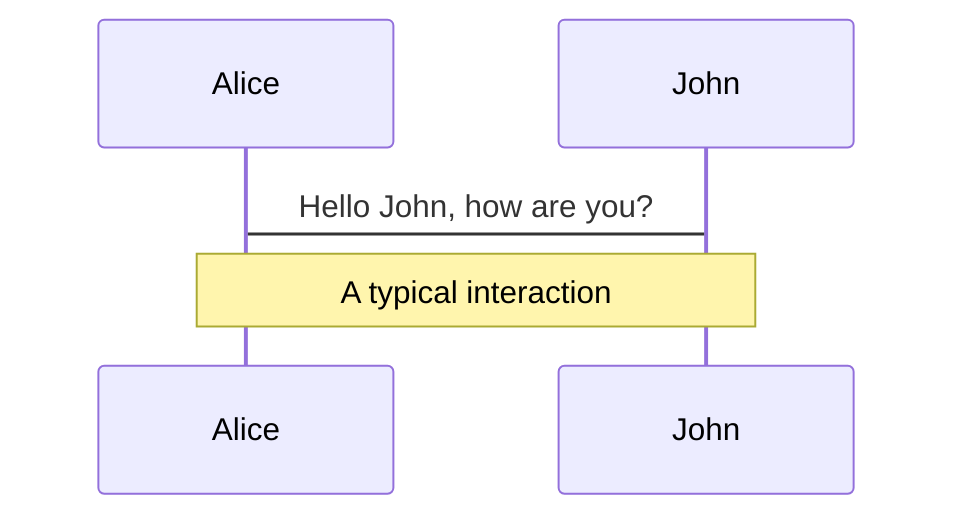
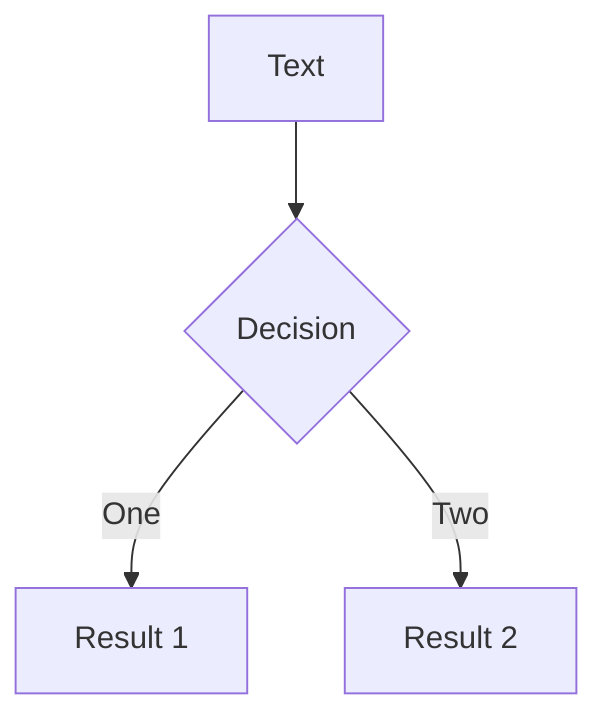

# Diagrams

You can create diagrams / graphs from textual descriptions, directly in your Markdown.

```mermaid {scale: 0.9}
sequenceDiagram
    Alice->John: Hello John, how are you?
    Note over Alice,John: A typical interaction
```

```mermaid {theme: 'neutral', scale: 0.8}
graph TD
B[Text] --> C{Decision}
C -->|One| D[Result 1]
C -->|Two| E[Result 2]
```

[Learn More](https://sli.dev/guide/syntax.html#diagrams)
